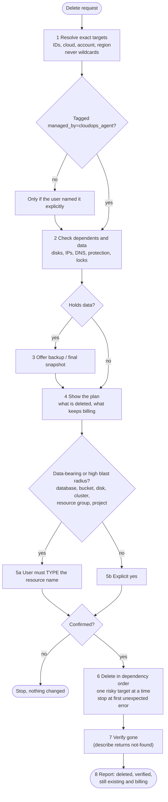

# Delete Protocol

Applies to [`cloudops-delete`](../../skills/cloudops-delete/SKILL.md). DESTROY-class: irreversible, so the agent is the last line of defense.

```mermaid
flowchart TD
  A([Delete request]) --> B["1 Resolve exact targets<br/>IDs, cloud, account, region<br/>never wildcards"]
  B --> C{"Tagged managed_by=cloudops_agent?"}
  C -- no --> C1["Only if the user named it explicitly"] --> D
  C -- yes --> D["2 Check dependents and data<br/>disks, IPs, DNS, protection, locks"]
  D --> E{"Holds data?"}
  E -- yes --> F["3 Offer backup / final snapshot"] --> G
  E -- no --> G["4 Show the plan<br/>what is deleted, what keeps billing"]
  G --> H{"Data-bearing or high blast radius?<br/>database, bucket, disk, cluster,<br/>resource group, project"}
  H -- yes --> I["5a User must TYPE the resource name"]
  H -- no --> J["5b Explicit yes"]
  I --> K{"Confirmed?"}
  J --> K
  K -- no --> X([Stop, nothing changed])
  K -- yes --> L["6 Delete in dependency order<br/>one risky target at a time<br/>stop at first unexpected error"]
  L --> M["7 Verify gone<br/>(describe returns not-found)"]
  M --> N(["8 Report: deleted, verified,<br/>still existing and billing"])
```
